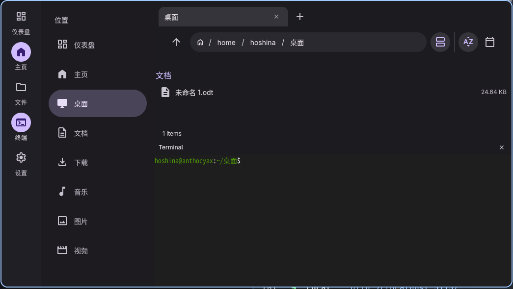

[简体中文](README-zh.md)

<p align="center">
  
</p>

# Hoshineko File Manager

<p align="center">
  
</p>

Hoshineko File Manager is a modern, "Performance-First" file manager built using Material 3 Design, Electron, and React.
The Hoshineko file explorer is a modification and reconstruction of [bhimio1](https://github.com/bhimio1)'s [material-3-file-explorer](https://github.com/bhimio1/material-3-file-explorer) project. This project was initiated because the original repository is no longer actively maintained, and we aimed to develop a file manager fully compliant with Material 3 Design standards.

## Features

- **Material Design 3 Interface**: sleek, modern UI with dynamic theming.
- **Performance First**:A file list processing mechanism refactored based on technologies like virtual lists, though frankly speaking, the performance is still limited by Electron and the web interface.
- **Tabs**: Tabbed navigation support.
- **Omnibar**: Unified search and address bar, compatible with fd and standard shell commands.
- **Built-in Terminal Emulator**: Built-in terminal emulator support.
- **Preview Support**: Quick look for common file types.

## Refactoring and modification of core functionalities from material-3-file-explorer project

- **Free for Multi Selection**: Features multi-selection capabilities, with optimized drag-and-drop transmission for applications such as LocalSend.
- **Better File Categorization**:Refactored file categorization mechanism to support a wider range of file types; includes icon display for specific device types within the /dev directory (this feature is currently under active development).
- **Convenient and Smart Right-Click Menu**:Refactored the context menu architecture to dynamically display specific menu items based on the selected item type, while extending menu features; the menu design is optimized for long-press gestures on touchscreen devices.
- **The rest includes a massive amount of refactoring and completion relative to the [material-3-file-explorer](https://github.com/bhimio1/material-3-file-explorer) project, equipping it with the characteristics of a modern file manager.**

##Internationalization

###/ Currently Supported

| Code      | Native Name                      | Chinese Description            | English Description)                           |
| :-------- | :------------------------------- | :----------------------------- | :--------------------------------------------- |
| **zh-CN** | 简体中文                         | 简体中文                       | Simplified Chinese                             |
| **zh-HK** | 繁體中文（香港）                 | 繁体中文（香港）               | Traditional Chinese (Hong Kong)                |
| **zh-CT** | 粵語                             | 粤语                           | Cantonese                                      |
| **zh-TW** | 正體中文（台灣）                 | 正体中文（台湾）               | Traditional Chinese (Taiwan)                   |
| **en-US** | English                          | 英语                           | English                                        |
| **ja-JP** | 日本語                           | 日语                           | Japanese                                       |
| **ko-KR** | 한국어（대한민국）               | 韩语（大韩民国）               | Korean (Republic of Korea)                     |
| **ko-KP** | 한국어（조선민주주의인민공화국） | 韩语（朝鲜民主主义人民共和国） | Korean (Democratic People's Republic of Korea) |
| **ko-CN** | 조선어（중국）                   | 朝鲜语（中国）                 | Korean (China)                                 |

### 计划支持 / Planned Support

| Code      | Native Name           | Chinese Description | English Description) |
| :-------- | :-------------------- | :------------------ | :------------------- |
| **ru-UA** | Русский（Украина）    | 俄语（乌克兰）      | Russian (Ukraine)    |
| **uk-UA** | Українська（Україна） | 乌克兰语（乌克兰）  | Ukrainian (Ukraine)  |

## Custom Theme Colors (Matugen)

The tutorial for custom theme colors is outdated and will be updated once the theme feature becomes available.

The software supports custom theme colors via [Matugen](https://github.com/InioX/matugen).

1. Install Matugen.
2. Generate the theme file at `~/.config/matugen/theme.css`.
3. The software will automatically detect and apply this theme upon startup.

An example of generating a theme from a wallpaper:

```bash
mkdir -p ~/.config/matugen/theme.css

matugen image --type scheme-tonal-spot /path/to/bg/backgrounda.jpg > ~/.config/matugen/theme.css
```

Where `--type` specifies the color scheme mode, options include:

1. scheme-tonal-spot (Default): Classic Material 3 palette, with relatively restrained and harmonious colors.

2. scheme-vibrant: High saturation, with more vibrant colors.

3. scheme-expressive: Richer mixed colors, with distinct contrast.

4. scheme-monochrome: Monochrome / grayscale.

## Installation

Please switch to "Releases" page

### Manual Build

1. Clone the repository:

   ```bash
   git clone new git
   cd Hoshineko
   ```

2. Install dependencies:

   ```bash
   npm install
   ```

3. Run in development mode:

   ```bash
   npm run dev
   npm run electron:dev
   ```

4. Build for production:
   ```bash
   npm run electron:build
   ```

## License

MIT
